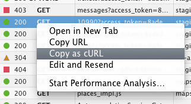

# curlformat

Do this in Firefox or Chrome.



Then type `f` in your terminal, then paste. Your command line should look like:

```sh
$ fcurl 'http://site.com/article/new' -H 'Host: site.com' -H 'Connection: 
keep-alive' -H 'Accept-Language: en-us' ...
```

It should be printed out in a format that's more readable.

```sh
$ http POST http://site.com/article/new \
    title="Hello"
```

Pass `--extended` to make print more stuff that would've been supressed.

```sh
$ http OPTIONS 'http://site.com/users' \
   Connection:"keep-alive" \
   Access-Control-Request-Method:"GET" \
   Origin:"http://site.com" \
   Accept-Encoding:"gzip, deflate" \
   Accept-Language:"en-US,en;q=0.5" \
   Accept:"text/html,application/xhtml+xml,application/xml;q=0.9,*/*;q=0.8" \
   User-Agent:"Mozilla/5.0 (Macintosh; Intel Mac OS X 10.9; rv:31.0) Gecko/20100101 Firefox/31.0" \
   Host:"staging.tripid.com.ph"
```

## :copyright:

**curlformat** © 2014+, Rico Sta. Cruz. Released under the [MIT License].<br>
Authored and maintained by Rico Sta. Cruz with help from [contributors].

> [ricostacruz.com](http://ricostacruz.com) &nbsp;&middot;&nbsp;
> GitHub [@rstacruz](https://github.com/rstacruz) &nbsp;&middot;&nbsp;
> Twitter [@rstacruz](https://twitter.com/rstacruz)

[MIT License]: http://mit-license.org/
[contributors]: http://github.com/rstacruz/curlformat/contributors
